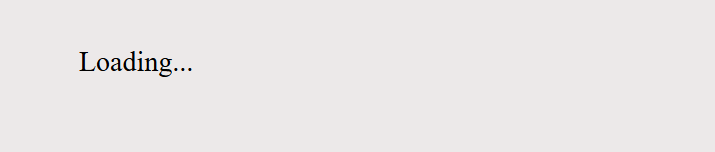
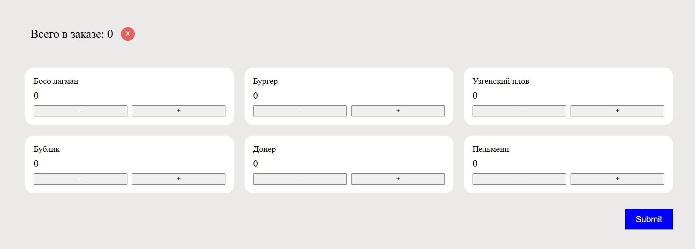
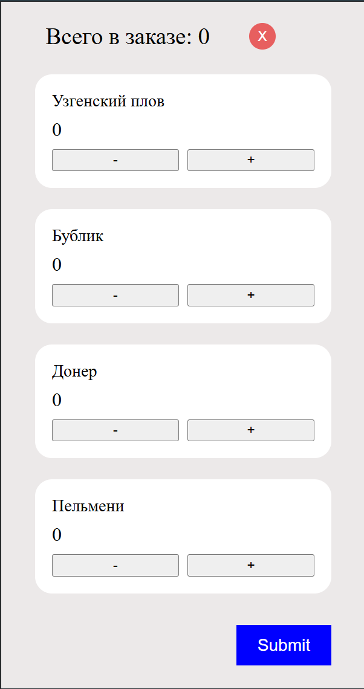
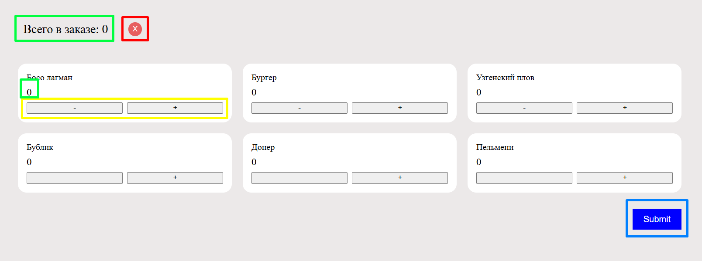
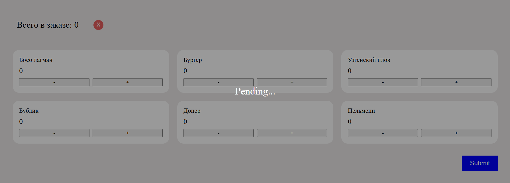
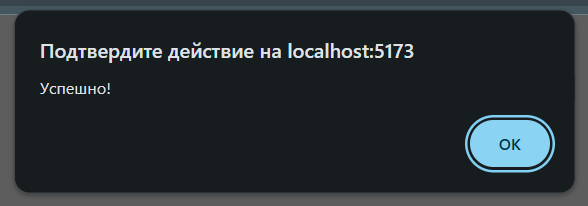

container max width: `1280px`;

reset button color: `#e75f5f`;

submit button color: `#0000ffff`;

food card background color: `#ffffff`;

<h3>
1. При первой загрузке страницы (on mount) нужно запросить список блюд,
   вызвав API getFoods(). Метод возвращает список Food.
</h3>

<h3>
2. После загрузки нужно отрисовать:

- список блюд
- общее количество выбранных блюд
- кнопку Submit
  </h3>

<h3>
3. Доступные действия:

- добавить блюдо в заказ
- удалить блюдо из заказа
- очистить заказ (Reset)
- оформить заказ (Submit)
  </h3>

<h3>
4. При нажатии на Submit:

- вызвать API submitOrder()
- начать проверку статуса заказа вызвав API getOrderState() каждую секунду
- пока статус != Completed, отображать overlay "Pending..."
  </h3>

<h3>
5. После получения статуса Completed:

- скрыть overlay
- очистить заказ
- вернуться в начальное состояние
  </h3>

